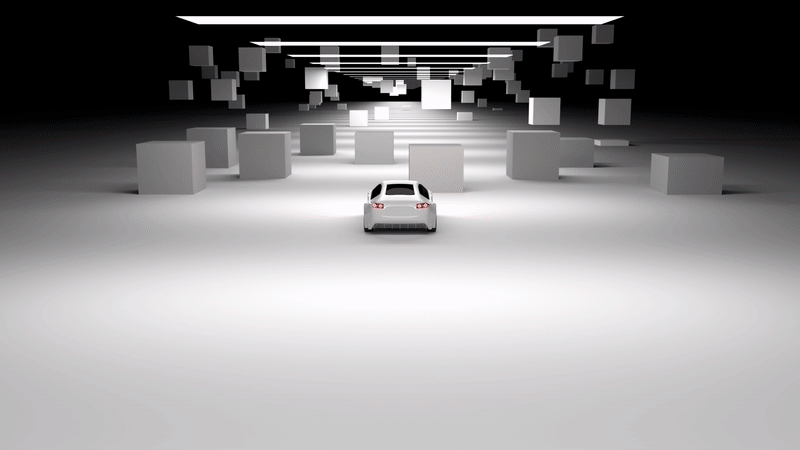

# ezgif-essentials

Want to generate GIFs of the highest quality? Tired of having too many unecessary parameters? You also happen to be a motion graphic designer? `ezgif-essentials` is a pseudo-opinionated video/sequence to GIF CLI converter. It uses the same robust conversion pipeline as [ezGIF](https://ezgif.com/) without the frame rate limitations or involuntary compression. It is powered by [FFmpeg](https://github.com/kkroening/ffmpeg-python), [Gifsicle](https://github.com/kohler/gifsicle) and my frustration with all GIF converters.

<table width="100%">
  <tr>
    <th>Converted by ezgif-essentials</th>
  </tr>
  <tr>
    <td width="100%">
      
    </td>
  </tr>
  <tr>
    <th>Converted by ezgif.com</th>
  </tr>
  <tr>
    <td width="100%">
      
    </td>
  </tr>
</table>

> Comparisons are both generated with their highest respective settings. There isn't even a competition. The answer is obvious.

## Installation (Debian-based)

> Currently, there's no way to use `ezgif-essentials` on Windows

Clone this repository

```bash
git clone https://github.com/winstxnhdw/ezgif-essentials.git
```

Install the `ffmpeg-python` module

```bash
pip install ffmpeg-python 
```

Install `gifsicle`

```bash
sudo apt install gifsicle
```

Test the script

```bash
python main.py -h
```

## Usage (Video)

> Transparency is disabled by default to allow for more colour palettes when generating more complex GIFs

```bash
python main.py -i test.mp4 -z 3
```

```yaml
Optional arguments:
-h, --help              show this help message and exit
-z, --optimise          optimise GIF file size with zero quality penalty (1 - 3)
-l, --lossy             number of artefacts allowed for compression (0 - 200)
-w, --transparent       enables transparency
```

## Usage (Sequence)

> WARNING: Please name your images with the appropriate amount of leading zeros. Read more about it [here](https://unix.stackexchange.com/questions/77016/ffmpeg-pattern-type-glob-not-loading-files-in-correct-order).

```bash
python main.py -i 'image/*.png' -a -r 50 -z 3
```

```yaml
Required arguments:
-a, --assemble          prepares the script for an image sequence

Optional arguments:
-h, --help              show this help message and exit
-r, --fps               set the fps of the resultant GIF
-z, --optimise          optimise GIF file size with zero quality penalty (1 - 3)
-l, --lossy             number of artefacts allowed for compression (0 - 200)
-w, --transparent       enables transparency
```

## Frequently Asked Questions

1. The output GIF has a lower FPS than the input video when I use the optimise flag.

> This is intended. Gifsicle optimises the GIF by removing unnecessary frames that do not contribute to the visual appearance of the animation.

2. Why can't I set a specific FPS parameter for video-to-GIF conversions?

> The output GIF will always have the same FPS as the input video. However, if your input video is above 50 FPS, the frame rate of the resulting GIF will be capped to 50. This is because frame rates between 50 and 100 are not supported by the standard [GIF89a specification](https://www.w3.org/Graphics/GIF/spec-gif89a.txt).

3. Why is the `lossy` argument capped at 200?

> According to the author, Kornel Lesiński: "It works best when only little loss is introduced, and due to limitation of the compression algorithm very high loss levels won't give as much gain." Read more [here](https://kornel.ski/lossygif).
